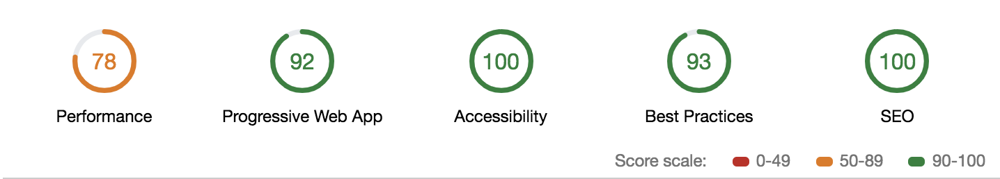

## E-Commerce PWA built with NextJS and GraphqlCMS

### How to run (development)

```
git clone git@github.com:junlee91/eCommerce-web.git
cd soda-store
yarn
yarn dev
```

### Production

```
yarn build && yarn start
```

### Google Chrome Audits for PWA

[Web Page Audit with Chrome Developer Tools and Lighthouse](https://www.vojtechruzicka.com/chrome-audit-lighthouse/)

[](https://github.com/junlee91/eCommerce-web/blob/master/images/audits.png)
